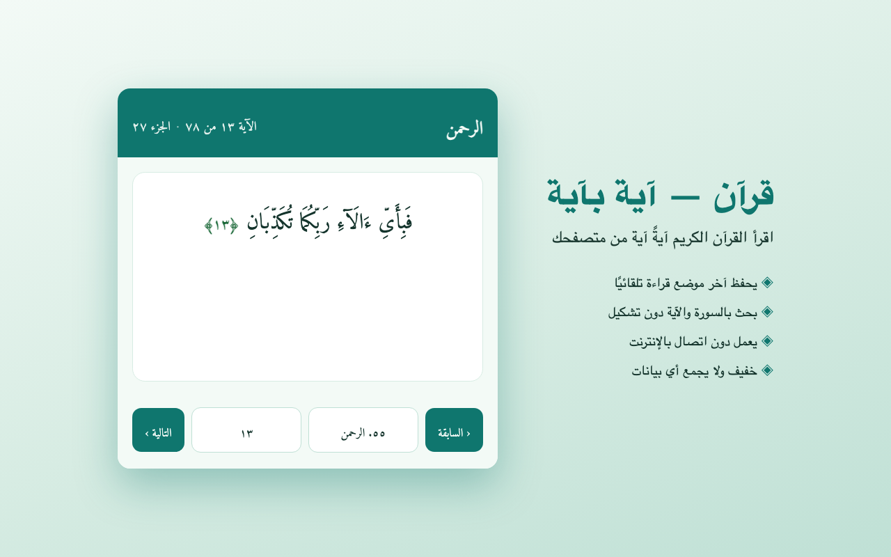

# قرآن — آية بآية | Quran — Ayah by Ayah

A super-light Chrome extension (Manifest V3) that shows **one Quran verse at a time** in the toolbar popup, so you can read in the small pockets of free time during the day. Fully offline, fully RTL Arabic, and it always remembers exactly where you stopped.



## The idea

Open the popup → read an ayah in the Amiri Quran typeface → tap **التالية/السابقة** to move verse by verse (crossing surah boundaries automatically) → close the browser whenever; your position is saved locally on every navigation. A modal picker lets you jump to any surah (search by name or number) and any ayah (search by number or by **bare Arabic text without tashkeel** — typing `الرحمن` finds `ٱلرَّحْمَٰنِ`).

Principles: no framework, no build step, no background worker, no network at runtime, and only one permission (`storage`). The full Quran text (6,236 ayahs) and the font are bundled; only the ~30 KB index plus the current surah are loaded per popup open.

## Folder structure

| Path | What it is |
|---|---|
| `manifest.json` | MV3 manifest: action popup, `storage` permission, icons. Nothing else — by design. |
| `popup.html` | The popup shell (`dir="rtl" lang="ar"`): header (surah / ayah-of-total / juz), verse card, footer nav with the two picker triggers. |
| `css/popup.css` | All styling: bundled `@font-face` for Amiri Quran, 420×420 rounded popup, green/white palette, modal picker styles. |
| `js/popup.js` | Entry point. Holds current position, renders header/verse/pickers, navigation logic, keyboard arrows, calls save on every move. |
| `js/data.js` | Lazy data layer: loads the surah index once and surah files on demand (memoized); juz lookup; skips the decorative `verse_0` bismillah. |
| `js/storage.js` | Reading position via `chrome.storage.local`, with a `localStorage` fallback so the popup also runs as a plain web page (dev/testing). |
| `js/dropdown.js` | The reusable picker: trigger button + in-popup modal with optional debounced search and scrollable list. |
| `js/arabic.js` | Tashkeel-insensitive search normalization (see the ⚠️ bidi warning inside before editing its regexes). |
| `data/` | Bundled Quran text: `surah-index.json` (114 surah metadata + juz ranges) and `surah/surah_1..114.json` (verse text). Source: [semarketir/quranjson](https://github.com/semarketir/quranjson). |
| `fonts/` | The exact Amiri Quran v19 woff2 files that Google Fonts serves to Chrome (arabic + latin subsets, 58 KB). |
| `icons/` | Extension icons 16/32/48/128, generated (anti-aliased crescent). |
| `scripts/` | Build-time only, never shipped: `fetch-data.mjs` (download Quran JSON), `fetch-font.mjs` (download the font), `make-icons.py` (regenerate icons), `package.mjs` (build + verify the store zip). |
| `test/e2e.mjs` | 21-check end-to-end suite driving the popup in headless Chrome via the DevTools Protocol (no dependencies). Run instructions in the file header and in `updates/`. |
| `store/` | Chrome Web Store kit: `LISTING.md` (ready-to-paste dashboard texts), `PRIVACY.md`, `screenshots/` (1280×800), `stage.html` (screenshot backdrop). |
| `dist/` | Built submission zip (`node scripts/package.mjs`). |
| `plans/` | Approved implementation plans, kept in-repo as project history. |
| `updates/` | Dated deep-dive documents (changes + architecture) for onboarding developers/agents — start with the newest file. |

## Development

```bash
# Load in Chrome: chrome://extensions → Developer mode → Load unpacked → this folder

# Run it as a plain page (storage/data fall back to web APIs):
python3 -m http.server 8749   # then open http://127.0.0.1:8749/popup.html

# E2E tests (needs Chrome + Node ≥22): see test/e2e.mjs header
# Package for the store:
node scripts/package.mjs      # → dist/one-quran-v<version>.zip
```

## Future work / known issues

- **Verse picker rebuild**: `renderVerseDropdown` runs on every navigation; it only needs to run when the surah changes. Cheap today, but the easiest perf win.
- **Search recall vs precision**: deleting all alef forms (needed for Uthmani↔modern matching) admits some false positives; a smarter mapping table could tighten it.
- **Highlight the current ayah** in the verse picker and scroll it into view when opened.
- **`chrome.storage.sync`** for the position, so reading continues across the user's devices (mind sync quota/rate limits).
- **Juz-based navigation** — the data already carries juz ranges; a third picker or a juz badge jump would be natural.
- **Bookmarks / multiple positions** (e.g., a personal wird plus casual reading).
- **Options page**: font size, theme (a dark variant of the green palette).
- **i18n via `_locales`** if a non-Arabic listing is ever wanted (UI itself stays Arabic by design).
- **CI**: run `test/e2e.mjs` headlessly on push; the harness needs no dependencies.
- **Rounded corners** are CSS-side only; the outer popup window frame belongs to Chrome/the OS (already rounded on macOS).
- Audio, tafsir, and translations are **intentionally out of scope** — the source repo has audio, but this extension is text-only by requirement.

## Privacy

No data collection, no analytics, no network requests. The only stored value is the last-read surah/ayah, kept locally on the device. See `store/PRIVACY.md`.
